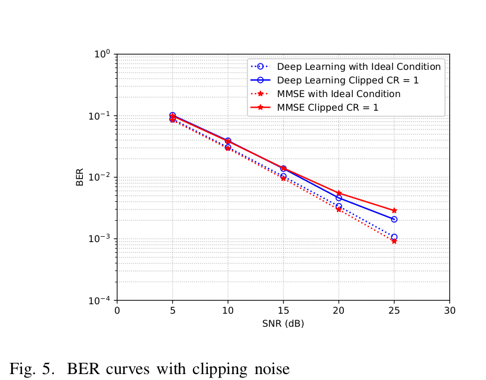
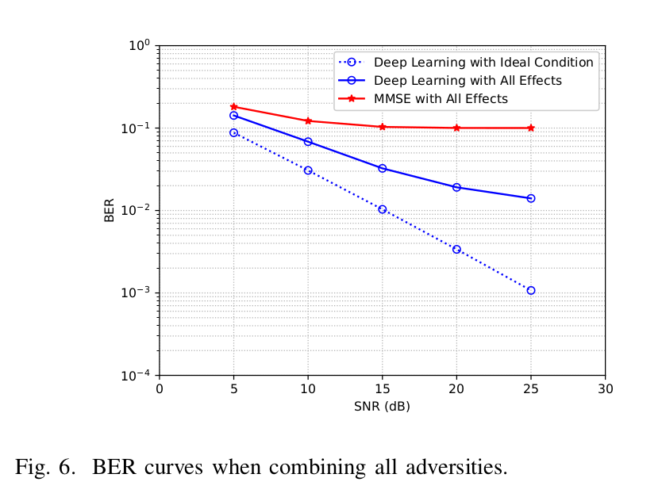
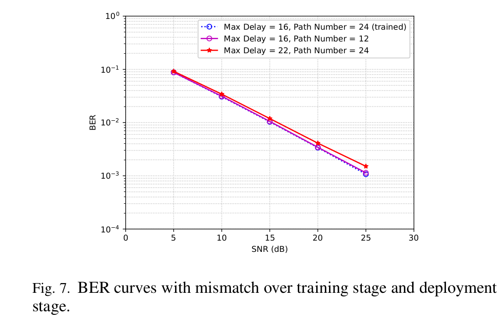

# 
 Power of Deep Learning for Channel Estimation and Signal Detection in OFDM Systems

- [
 Power of Deep Learning for Channel Estimation and Signal Detection in OFDM Systems
](#center-power-of-deep-learning-for-channel-estimation-and-signal-detection-in-ofdm-systemscenter)
  - [摘要](#摘要)
  - [引言](#引言)
  - [基于深度学习的评估和检测](#基于深度学习的评估和检测)
    - [先导知识](#先导知识)
    - [A 深度学习方法](#a-深度学习方法)
    - [B 系统架构](#b-系统架构)
    - [C 模型训练](#c-模型训练)
  - [仿真结果](#仿真结果)
    - [A 导频数量的影响](#a-导频数量的影响)
    - [B 循环前缀的影响](#b-循环前缀的影响)
    - [C 削波噪声和滤波噪声的影响](#c-削波噪声和滤波噪声的影响)
    - [D 鲁棒性分析](#d-鲁棒性分析)
  - [总结](#总结)
## 摘要

这篇文章展示了我们在正交频分复用（OFDM）中信道估计和信道检测的深度学习中的初步结果。在这篇文章中，我们尝试使用深度学习以端到端的方式来处理无线正交频分复用的信道。与现有的先评估信道状态信息（CSI）然后检测或者恢复传输信号的OFDM接收器不同的是，我们提出的基于深度学习的方法保守地评估CSI然后直接恢复传输信号。为了解决信道混乱的问题，深度学习的模型首先会用基于信道数据生成的模拟数据进行离线训练然后直接用于恢复在线传输数据。从我们的仿真结果中可以看出，基于深度学习的方法能够解决信道混乱问题并且在检测传输信号时能够媲美最小均方差（MMSE）评估器。此外，基于深度学习的方法在使用更少的训练样本，忽略循环前缀（CP），存在非线性削波噪声时比传统方法更加稳定。

## 引言

OFDM是一个为了解决无线信道中频率选择性衰退而广泛应用于无线宽带系统的流行的模块方案。CSI对于相干检测和OFDM系统中解码至关重要。通常CSI能够在检测到传输数据之前通过导频进行估计。通过评估CSI，传输信号能够在接收端被恢复。

OFDM系统中的信道估计已经被研究透了。传统的评估方法，比如最小平方（LS）和MMSE已经在不同环境下应用并且优化了。LS方法不需要前置信道数据，但是他的表现稍差。MMSE通过使用信道数据的二阶统计量在总体上来说能有更好的检测表现。

在本文中我们引入了一个深度学习方法来在一个OFDM系统上做信道估计和符号检测。深度学习和人工神经网络有大量的应用。尤其是已经成功应用于基于CSI的定位，通道均衡和通信系统中的信道解码。随着设备不断增强的计算属性和大量数据更加容易获取，我们期待用深度学习在通信系统中有更多的应用。

人工神经网络已被证明用于具有在线训练的信道均衡，即根据在线导频数据调整参数。但是，这样的方法不能直接使用，因为通过深度神经网络，参数的数量变得及其庞大，这需要大量的训练集和很长的训练周期。为了解决这个问题，我们训练了一个深度神经网络来预测不同信道情况下的传输数据。然后这个模型用于在线部署以恢复传输数据。

这篇文章解释了DNNs有能力去学习和分析无线信道的可能会受到非线性噪声和频率选择性之外的干扰的特征。根据我们所知，这是第一次不通过在线训练使用学习方法解决无线信道的问题。仿真结果表明深度学习模型在有足够导频的情况下获得媲美传统方法的结果，并且在有限导频，信道干扰和非线性噪声情况下表现更好。我们最初的结果表明深度学习有很大的潜力能够应用于信号处理和通信的许多方向。

## 基于深度学习的评估和检测

在这一部分，我们展示了深度学习被开发成信道评估和信号检测的端到端的方法。DNN模型基于仿真数据离线训练，相当于将OFDM和无线信道看作黑盒。

### 先导知识
首先简单介绍一下传统的通信是怎么做的。用最简单的例子讲解一下：

假设基站发送的信号为x， 信道为 h, 不考虑噪声的话， 那么接收信号 y = hx。 而接收端要做的就是从y恢复出原始信号x。 显然，这非常容易， x = y / h， 小学数学题。 这里的问题在于，接收端并不知道h是什么~因此， 就需要信道估计， 来估计出h。 思路也非常简单， 基站会先发送一个pilot信号x1 (实际中为了估计的更准确， 往往是发送一串），这个pilot信号，中文被称为导频信号。 这个是基站和接收端约定好的，也就是说，接收端是已知x1的。 这时候， 接收端接收到的经过信道的信号就是 y = hx1， 那么就可以再用小学数学解出 h = y / x1。这就是信道估计的思路。 当然在实际中由于噪声等问题， 不会这么简单地处理， 比如会用MSE准则来估计等。 但万变不离其宗， 传统通信的基本思想就是这样。

* OFDM系统： 本文是基于OFDM架构， 这里就不详细解释了。 简单地说下就是， 我刚刚举的例子， x都是一个一个比特的发送， 在实际的OFDM系统中， 信号是一帧一帧的发送， 比如64个比特组成一帧，再通过FFT， IFFT等操作到频域端处理~这里大家只要记住， y = hx中， x 和 y 都是向量（含有多个比特）。 举文中的一个例子： 基站先发送了一帧64 * 1的导频信号， 再发送了一帧64 * 1的数据信号， 那么接收端总共收到的就是128*1的一个向量。 注意， 通信中因为信号分为I路和Q路发送， 所以向量中的每个元素都是一个复数。 而主流的深度学习框架（tensorflow， pytorch）往往都是只支持实数操作的，所以文中采用的操作就是把向量的实部和虚部拆分后再拼接成一个256 *1的实数向量， 即向量的前128个元素是原向量的实部， 后128个元素是虚部。 从信息的角度看， 原复数向量的信息没有任何丢失地输入到了网络中。
* 导频数据， 以上个例子为例。 作者令基站发送两帧信号，第一帧为导频，第二帧为数据。 那么需要注意的重点是——这个导频序列可以是任意的 （ 1 0 0 1 … 或是 0 0 1 1…并不重要）， 但必须是统一的。 即训练和测试中的导频序列要永远保持一致。 这一点很容易理解——用同一个导频序列， 对网络进行训练，那么在训练的过程中， 网络会逐渐地学习到这个导频序列， 并会以这个导频序列来进行信号处理。 结果你在测试的时候，突然换了另一个导频序列， 那显然网络就工作不了了。
* 多个网络并行。 这一点很多读者都容易想不通， 但其实非常简单。 还是刚刚的例子， 基站发送了两帧数据， 其中第二帧的64 * 1的复数向量是数据， 即128个比特的信息。 那么最直接的就是指定网络的输出就是128 * 1的实数向量， 每个元素对应每个恢复的比特。 但是作者没有采用直接的思路， 文章的做法是使用8个并行的网络， 每个网络的输入和结构都一模一样， 分别负责16个比特的检测。 加起来就检测了所有128个比特。比如第一个网络检测的是1-16个比特， 第二个就是17-32个比特…。 这里主要有两个注意点： 1. 每个网络虽然只检测16个比特， 但是都会输入所有的接收信号。 这是因为OFDM系统中每个比特都和所有的接收信号相关。 即使不从通信的角度考虑， 我们也应该把所有可得的信息都交给网络来处理。 2. 其实是可以只用一个网络来直接检测128个比特。一个网络的性能即误码率，性能比分成8个网络差了不少。 因此，虽然分成8个网络增加了复杂度， 但是性能上提升了很多。 这里提一句： 在代码中， 其实只需要仿真一个网络就可以了， 而不需要仿真8个网络——因为我们的目标是误码率，这本来就是比特的平均值，所以1个网络的误码率和8个网络是一样的， 因此仿真一个网络的结果和8个网络的结果一样

### A 深度学习方法

DNN模型的结构如图所示。总的来说，DNNs是ANNs为了增强表征或者识别能力增加隐藏层后的加深版本。网络的每一层都包含多个神经元，每一个神经元都有一个前一层神经元的加权和的非线性函数的输出。非线性函数可以是Sigmoid也可以是Relu。这样，神经网络z的输出就是一个输入数据I的非线性转换级联，数学表达式为：

$$\mathbf{z}=f(\mathbf{I}, \boldsymbol{\theta})=f^{(L-1)}\left(f^{(L-2)}\left(\cdots f^{(1)}(\mathbf{I})\right)\right)$$

其中L表示层的总数，θ表示神经网络的权重。模型的参数是神经元的权重，这是在线上部署之前要优化好的。最佳的权重通常是在一个已知期望输出的训练集上学习到的。

  

### B 系统架构

带有基于深度学习的信道评估和信号检测的OFDM系统的架构如图所示。基带OFDM系统和传统的系统是一样的。在传输端，插入的带有导频的信号首先被转化成平行的数据流，然后用逆离散傅里叶变换（IDFT）将信号从频域转换到时域。之后，插入一个循环前缀（CP）减轻内部信号的干扰（ISI）。CP的长度不应该短于信道的最大延迟扩展。

我们考虑一个由复随机变量描述的样本间隔的多路信道$\{h(n)\}_{n=0}^{N-1}$。这样接收到的信号，y(n)，就可以被表示为

$$y(n)=x(n) \otimes h(n)+w(n)$$

其中$\otimes$表示循环卷积而x(n)和w(n)分别表示传输信号和附加的高斯噪音（AWGN）。在移除循环前缀（CP）和执行完离散傅里叶转换后，获取到的频域信号是

$$Y(k)=X(k) H(k)+W(k)$$

其中Y(k)，X(k)，H(k)和W(k)分别是y(n)，x(n)，h(n)和w(n)的傅里叶转换

我们假设导频信号是在第一个OFDM块中而之后的OFDM块是由传输信号组成的。他们共同形成了一帧。信道被视为连续跨越导频块和数据块，而不是从一帧转变到另一帧。在最初的研究中，DNN模型将由导频块和数据块组成的接收信息作为输入，并且以一个端到端的方式恢复传输信息。

为了获取到一个能够有效结合信道评估和信号检测的DNN模型，设计了两个阶段。在离线训练阶段，模型通过接收到的由不同信息序列产生的并且在有着不同信息属性的信道环境下的OFDM样本进行训练，比如典型的城市或丘陵地形延迟分布。在线上部署阶段，DNN模型生成能够恢复传输数据的输出而无需准确地评估无线信道。

  

### C 模型训练

通过将OFDM技术和无线信道视为黑盒来训练模型。此前，研究者们已经为信道状态信息（CSI）开发出了许多信道模型，这些模型能够很好地在信道统计方面描述真实信道。通过这些信道模型，训练集可以通过仿真获取到。在每一次仿真中，首先会生成一个随机的数据序列作为传输信号，并且通过导频信号生成对应的OFDM帧。当前的随机信道状态就是基于信道模型生成的。接收到的OFDM信号是基于当前信道失真的OFDM帧得到的，包括信道噪声。接收到的信号和原始的传输数据被收集作为训练集。训练模型来最小化输出和传输数据的差距。这个差距可以用多种方式描述。本文选择的是$L_2$损失

$$L_{2}=\frac{1}{N} \sum_{k}(\hat{X}(k)-X(k))^{2}$$

其中$\hat{X}(k)$是预测值X(k)是监督信息也就是标签。

我们使用的DNN模型包含5层，其中三层是隐藏层。每层的神经元个数256，500，250，120，16.输入的数量对应两个分别包含了导频和传输信号的OFDM块的实部和虚部。每16比特的传输信息会作为一组并且在基于独立训练的模型上做预测，然后连接到最后的输出上。前面的层都是用的relu作为激活函数，最后一层用一个sigmoid函数将输出映射到[0,1]上。

## 仿真结果

我们已经执行了很多实验来解释深度学习对于OFDM无线通信系统中的联合信道估计和信号检测的表现。一个在仿真数据上训练出来的DNN模型在不同信噪比（SNRs）下和传统方法比较比特错误率（BERs）。在接下来的实验中，基于深度学习的方法被证明在更少的导频情况下忽略循环前缀或者不存在非线性噪声比LS和MMSE更加鲁棒。在我们的实验中，使用一个有64个副载波并且循环前缀长度为16的OFDM系统。无线频道遵循无线世界的新无线电模型倡议，载波频率为2.6GHz，通道数量为24，并且使用典型的最大延迟为16的城市信道。调制方法使用QPSK。

### A 导频数量的影响

首先将我们提出的方法和信道评估和检测的最小平方和最小均方差方法进行比较，其中对于每一个帧的信道检测使用64个导频。从图中可以看出，最小平方方法表现最糟糕，因为在检测中没有用到信道的导频数据。相反的，最小均方差方法有着最好的表现，因为通道的二阶统计量被认为是已知的并且用于信号检测。基于深度学习的方法比LS表现更好并且能和MMSE相媲美。

  

由于信道模型的最大延迟是16，他能够根据更少的导频进行评估，这会产生更好的频谱利用。根据上图，当仅使用8个导频的时候，最小平方和最小均方方法的比特错误率曲线在信噪比超微10dB的情况下达到饱和，而基于深度学习的方法仍然能够随着信噪比的提升减少他的比特错误率。DNN表现更好的理由是CSI并不是均匀分布的。无线信道的特征可以通过基于模型生成的训练数据学习到。

### B 循环前缀的影响

如之前所说，循环前缀对于将物理信道的线性卷积转变为循环卷积并且降低内部信号干扰（ISI）来说是必要的。但是它传输所花费的时间和能量代价也比较高。在本实验中，我们将研究不用循环前缀的表现。

下图表示一个没有循环前缀的OFDM系统的比特错误率曲线。从图中可以看出，MMSE和LS都不能有效地评估信道。在信噪比超过15dB的时候准确率达到饱和。但是，基于深度学习的方法仍然能够表现很好。结果表明无线信道的特征已被揭示并且可以在训练阶段被DNN学习到

  

### C 削波噪声和滤波噪声的影响

OFDM一个明显的缺陷就是具有较高的峰均功率比（PAPR）。为了减少PAPR，削波噪声和滤波噪声方法能够作为一个简单有效的方法。但是，在使用了削波和非线性噪声之后，可能会损害评价和检测的表现。削波后的信号变成了

$$\hat{x}(n)= \begin{cases}x(n), & \text { if }|x(n)| \leq A \\ A e^{j \phi(n)}, & \text { otherwise }\end{cases}$$

其中A是阈值，$\phi(n)$是x(n)的相位。

下图描述了当OFDM存在削波噪声时MMSE和深度学习方法的表现。从图中可以看出，削弱比例（CR=A/σ，其中σ是OFDM信号的均方根）为1时，SNR超过15dB时，深度学习方法比MMSE更好，这表明深度学习方法对于非线性的削波更加鲁棒。

  

下图比较了所有上述优势结合到一起时的DNN和MMSE，比如仅使用8个导频，忽略循环前缀，设置削波噪声。从图中可以看出，DNN比MMSE更加好但是在相比自身理想环境下的检测表现仍然存在一定差距。

  

### D 鲁棒性分析

在以上的仿真中，信道在线上部署阶段生成的是和在离线训练阶段相同的统计。但是在现实世界的应用中，可能会出现两个阶段的误匹配。因此将模型训练到对于这些误匹配足够鲁棒是相当重要的。在仿真中，我们分析了训练和部署阶段信道模型使用的统计的变化的影响。下图展示了测试阶段的最大延迟和路径数量和训练阶段使用的参数不同时的BER曲线。从图中可以看出，信道模型统计的变化对信号检测的表现不会有太大的影响。

  

## 总结

这篇文章中，我们讲述了我们最初将DNN用于OFDM系统中的信道评估和信号检测所作的工作。模型基于仿真数据进行离线训练，将OFDM和无线信道看作是黑盒。仿真结果表明在无线信道被强失真和干扰变得复杂的情况下深度学习方法具有优势，这证明了深度学习方法能够记忆并且分析复杂的信道特征。在实际应用中，DNN模型拥有一个强泛化能力是很重要的，这样他在线上部署环境和训练环境大不相同的情况下仍然能够有效地工作。本文中之前进行的一个实验解释了DNN关于信道模型一些参数的泛化能力。更多精密的分析和更全面的实验会在之后工作中进行。此外，为了能实际应用，真实信道中产生的样本可以搜集来重新训练或者微调模型以获取更好的表现。