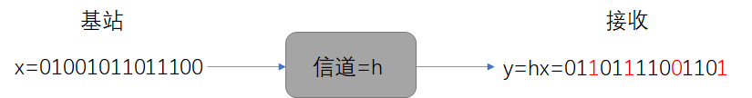
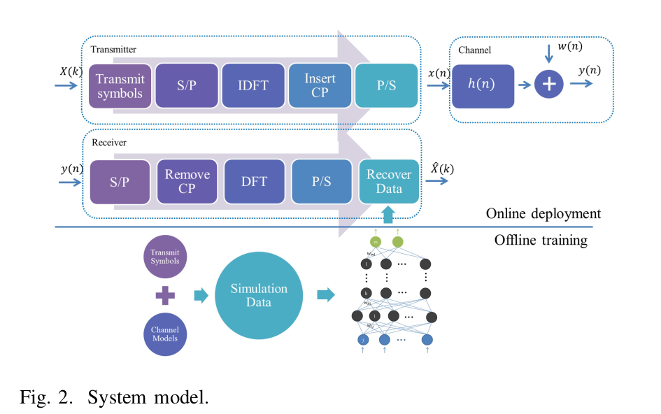
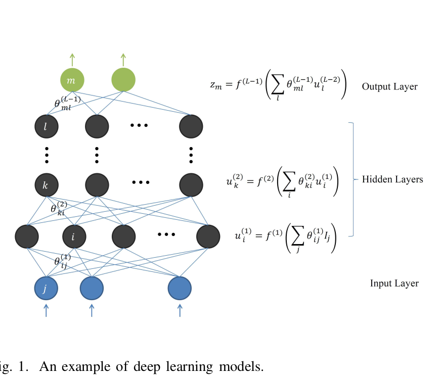
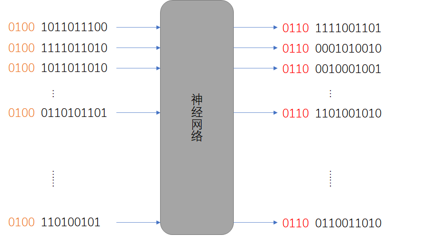
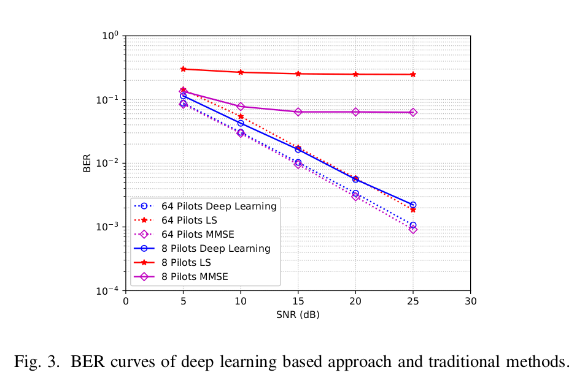
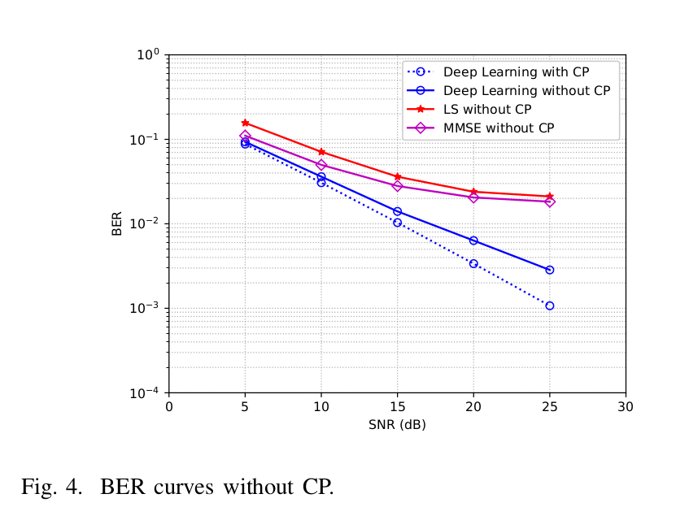

# Power of Deep Learning for Channel Estimation and Signal Detection in OFDM Systems

- [Power of Deep Learning for Channel Estimation and Signal Detection in OFDM Systems](#power-of-deep-learning-for-channel-estimation-and-signal-detection-in-ofdm-systems)
  - [先导知识](#先导知识)
  - [中心思想](#中心思想)
  - [具体实现](#具体实现)
  - [仿真结果](#仿真结果)
    - [导频数量的影响](#导频数量的影响)
    - [循环前缀的影响](#循环前缀的影响)
  - [总结](#总结)

## 先导知识

传统通信的做法：

假设基站发送信号为x，信道为h，在不考虑噪声的情况下，接收信号为`y=hx`。而接收端要做的就是根据收到的y恢复出原始的信号x。

  

显然恢复信号非常容易，`x=y/h`。但是问题在于接收端无法知道h是什么。在这种情况下就需要信道估计，来估计出所需要的h。

解决思路很简单，通过双方约定一个发送信息前必须发送的导频信号pilot。pilot信号对于双方可知，那么接收方就可以根据它得到信道的h。当然这是在忽略了噪声情况下的理想环境，真实环境下会有更多的方法，但基本思想都基于此。

* OFDM系统：上述例子中，x是逐bit发送的，而在OFDM系统中，信号是一帧一帧发送的。比如将64个bit打包成一帧，再通过一系列的处理，可以理解成`y=hx`中的x，y都是向量。另外，通信中信号分为I路和Q路发送，所以向量中的每个元素都是一个复数，即`a+bi`。
* 导频数据：根据上面的例子，在发送真实数据帧之前需要发送一个导频帧。这个导频帧可以是任意的，只要双方约定好。但是一旦确定了导频帧的内容，在训练过程中就不能更换了，否则神经网络没法进行工作。
* 循环前缀（CP）：将OFDM符号尾部的信号复制到头部，作用就是能够保证传输的不同帧的信号之间能够不互相干扰。具体原理我也没看懂。

## 中心思想

这篇文章是将深度学习的成熟技术用于通信物理层的处理经典之作，也是同领域引用之首。文章所做的就是用神经网络来取代原本传统通信中对信道的估计和信号检测的部分，并且作者并非用两个网络分别完成信道估计和信号检测，而是用一个网络同时完成这两个工作。

 

## 具体实现

我们需要设计神经网络就需要考虑三个东西：

* 输入是什么，输出是什么
* 损失函数选哪个
* 网络具体结构什么样

首先我们可以确定的是期望神经网络输出的结果应该是原本的输入信号，而在物理层的通信中x就是0或者1，所以可以转换为深度学习中的二分类问题，可以用MSE或者交叉熵作为损失函数。作者选用的是MSE作为损失函数。

$$L_{2}=\frac{1}{N} \sum_{k}(\hat{X}(k)-X(k))^{2}$$

网络的具体架构在无线通信中其实并不重要，它用不着太过复杂的神经网络。作者选用了一个全连接网络（DNN）。它由5层组成，各层用了256，500，250，120，16个神经元，因此网络架构在本文中并非重点。可以理解成作者找到了一个非常适合用深度学习方法解决的问题，然后挑选了一个简单的网络就获得了很好的效果。

 

现在我们需要确定输入和输出，输出很简单就是我们需要恢复的信号。输入就是在经历过信道之后也就是x变成hx之后的接收端所接受到的信号。

那神经网络对于这个输入，就不再需要像传统信道那样，做信道估计来估计h的值了，我们直接将基站发来的导频数据和真实数据连接成[y1,y2]输入进神经网络，神经网络就一定能够恢复出原始的信号。

  

刚才提到通信中每个元素是一个复数，而主流的深度学习框架只能处理实数，所以作者将这个复数的实部和虚部分开。这样一个64bit的帧对应的1×64的向量就可以变为1×128的向量。从信息的角度来看，没有信息的丢失，只有形式的转换。

作者设计的神经网络的输出为16并不是128，这是因为作者是通过8个相同结构的神经网络进行的训练，每一个神经网络只负责自己对应的那16个bit的检测。但是，虽然他们只负责16个bit，但是他们都需要获取全部的导频和真实数据帧，即输入的256。最后将每个网络所得到的信息组合起来就得到了我们需要的输出。

这样做的好处是，对于只使用一个网络进行训练来说，多个网络的误码率会更低。虽然增加了复杂度，但是性能上提高了很多。

## 仿真结果

### 导频数量的影响

图中展示了导频为8bit和64bit的情况下的各方法的表现。可以看出，在导频数据缺少的情况下，MMSE和LS的表现会非常差，基于深度学习的方法会比较好。而在导频充足的情况下，LS表现稍差，本文的方法和MMSE能相媲美。

 

### 循环前缀的影响

图中可以看出，没有循环前缀的情况下，MMSE和LS都不能有效评估信道，而对于基于深度学习的方法，没有循环前缀也能表现得很好，有循环前缀能表现得更好。

## 总结

本文的核心就在于将复杂的信道评估和信号检测统一丢尽神经网络中，他具体怎么实现我们不需要去关注。根据仿真结果表明这一方法即便实在干扰较强的复杂环境下仍然具有优势。