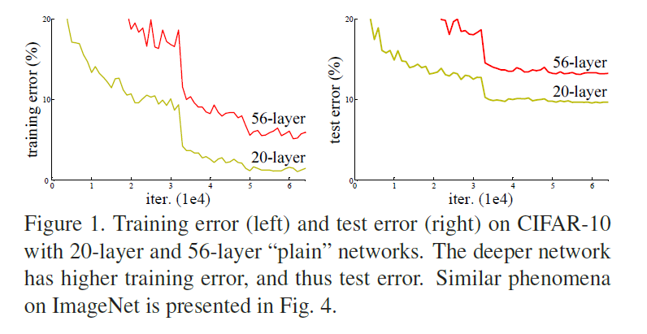
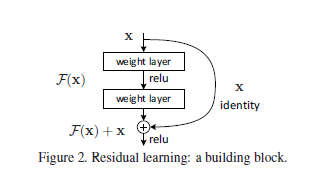
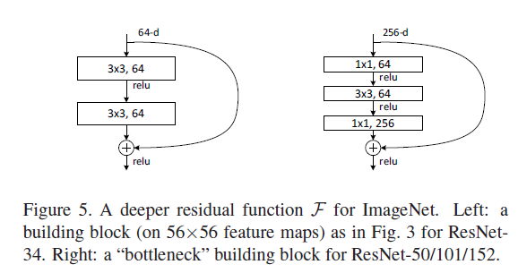
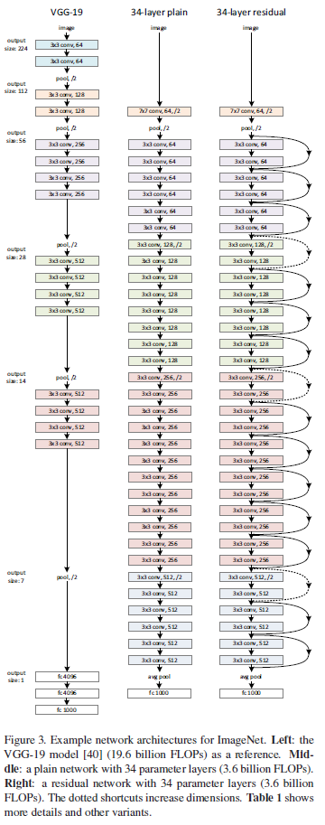
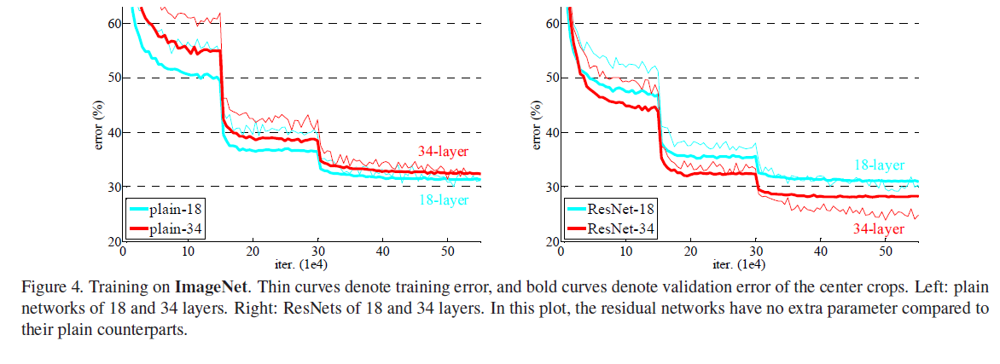
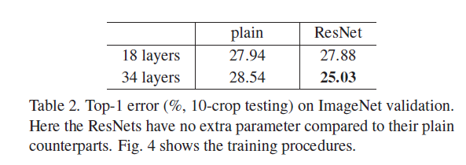
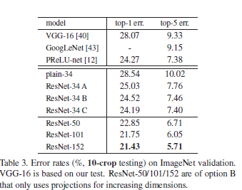

# Deep Residual Learning for Image Recognition

## 1.摘要

越深的神经网络越难训练。我们提出了一个残差学习框架来简化那些本质上比以往使用的网络更深的网络的训练。我们明确地将层重新表述为学习参考层输入的残差函数，而非学习非参考层的函数。

## 2.引言

深度卷积网络在图像分类方面引领了一些列的突破。深度网络自然地将低/中/高级特征和分类器以端到端多层方式进行集成，特征的“级别”可以通过堆叠层的数量（深度）来丰富。

但是有一个问题：学习更好的网络和堆积更多的层一样容易吗？回答这个问题的一大障碍是臭名昭著的梯度消失问题，它从一开始就阻碍了收敛。但是，这个问题已经通过标准初始化和中间标准化层很大程度上得到了解决，这使得数十层的网络能够通过具有反向传播的随机梯度下降进行收敛。

当深层网络能够开始收敛，一个退化问题暴露出来了：随着网络深度的增加，精度变得饱和然后迅速下降。意外的是，这种下降不是过拟合引发的，并且向一个深度合适的模型上添加层会导致更高的训练误差。如图所示：

  

这一退化问题表明，不是所有的系统都很容易优化。让我们来考虑一个更浅的结构和其对应的更深的对象，为其添加更多的层。存在通过构建得到更深层模型的解决方案：添加的层是恒等映射，其他层是学习到的较浅的模型的一个copy。这种结构的解决方案的存在表明较深的模型不应该产生高于较浅模型的训练误差。但是实验表明，目前的解决方案无法找到与构建方案相比相对不错或者更好的解决方案。

我们明确地让这些层拟合残差映射，而不是希望每几个堆叠的层直接拟合期望的基础映射。形式上，将期望的基础映射表示为H(x)，我们让堆叠的非线性层拟合另一个映射：F(x)=H(x)-x。这样原始的映射就可以重写为F(x)+x。我们假设残差映射比原始的无参考的映射更加容易优化。在极端情况下，如果一个恒等映射是最优的，那么将残差置为0比通过一系列非线性层去拟合恒等映射更加简单。

公式F(x)+x能够通过带有捷径连接的前向传播神经网络实现。捷径连接是指那些跳过了一个或多个层的连接。在本文中，结晶连接只是执行了一个恒等映射，并且它的输出会加到堆叠层的输出上，如图所示。

  

恒等捷径连接既没有添加额外的参数也没有增加计算复杂度。整个网络仍然能够通过带有后向传播的随机梯度下降进行端到端的训练，并且能够通过公共库轻松实现，无需修改解释器。

## 3.深度残差学习

### 3.1残差学习

我们将H(x)视为一个需要被少量堆叠层拟合的基础映射，x表示第一层所接收到的输入。假设多个非线性层能够渐近地近似于一个复杂函数，那么这就等价于它们能够渐近地近似于一个残差函数，例如H(x)-x。所以我们只需要简单地让这些层近似于一个残差函数F(x)=H(x)-x，而非让其近似于H(x)。原始函数就变为了F(x)+x。尽管这两种形式都能够渐近地近似于目标函数，但是它们进行学习的难易程度是不一样的。

关于退化问题的反直觉现象激发了这种重构。正如在引言中所探讨的一样，如果增加的层能够被构造为恒等映射，一个更深的网络的训练误差将不会优于其对应的浅层模型。这种退化问题表明求解器通过多个多个非线性层来近似于恒等映射会有困难。通过残差学习重构，如果恒等映射是最优的，求解器会简单地将多个线性层的权重置为0来得到恒等映射。

在真实事件中，恒等映射不太可能是最优解，但是我们的重构可能会对于问题预处理有所帮助。如果最优函数比零映射更加接近于恒等映射，对于解释起来说找到关于恒等映射的抖动应该比直接学习一个新的函数更加容易。

### 3.2通过捷径的恒等映射

我们每隔几个层应用残差学习。形式上，我们将一个building块定义为

$$y=F(x,{W~i~})+x \tag{1}$$ 

在这里x和y分别是相关层的输入和输出。F(x,{W<>i})表示需要学习的残差映射。

在公式1中的捷径连接既没有引入额外参数也没有额外计算复杂度。这不仅在实践中具有吸引力，而且在普通网络和残差网络的对比中也很重要。我们能够公平地比较同时具有相同参数量、深度、宽度和计算代价的普通和残差网络。

在公式1中F和x的维度是相等的。如果不是这种情况的话，我们可以执行一个线性投射Ws来使捷径连接与其维度匹配

$$y=F(x,{W~i~})+W~s~x \tag{2}$$
当然我们在公式1中也可以这么用。但是我们会通过实验证明恒等映射对于解决退化问题是非常合算的，因此$w_s$仅在匹配维度的时候使用。

残差函数F的形式是灵活的。本文的实验包括有两层或者三层的F，更多层也是有可能的，如下图。但是如果F只有一层，公式1就近似于一个线性层：y=Wix+x,对于这种情况我们尚未发现其有任何优势。

  

我们还观察到，景观上述的符号全是关于全连接层的，但是其对于卷积也同样适用。

### 3.3网络结构

我们测试了不同的普通/残差网络，并且观察到了相似的现象。

#### 普通网络

简单网络(中间)的基准主要受到VGG网络的启发。卷积层主要有3×3的滤波器并且遵循两个简单的设计原则：(1)对于相同的输出特征图形状，每层有相同数量的滤波器;(2)如果特征图的尺寸减半了，滤波器的数量就要加倍来保持每层的时间复杂度。我们通过步幅为2的卷积层直接进行降采样。网络通过一个全局平均池化层和一个具有softmax的1000维全连接层结束。带有权重的层个数为34。

值得注意的是这一模型相较于VGG有更少的滤波器和更低的复杂度。

#### 残差网络

基于上述的普通网络，我们插入了捷径连接，这样就将网络转变成了其对应的残差网络。输入和输出形状相同时，恒等捷径能够被直接使用。当维度增加时，我们有两个选择：(1)捷径任然是做恒等映射，对于多出来的维度填充0，这个选择不会增加额外的参数；(2)利用公式2进行投射来匹配维度。对于这两个选项，当捷径跨越两个尺寸的特征图时，它们的步长为2。

### 3.4实现
图像根据较短边进行重新设置尺寸，范围是[256,480]。从图像或者其水平方向的翻转做一个224×224的随机采样，并且逐像素减去均值。还要对其使用标准颜色增强。在每个卷积层之后激活函数之前还要应用批量归一化。批量大小为256并且使用随机梯度下降。学习率设置为0.1并且当误差稳定时除以10，模型要训练60×104个迭代。权重衰减设置为0.0001并且动量设置为0.9。不使用丢弃。

## 4.实验

### 4.1ImageNet分类

#### 普通网络

34层的普通网络相比于18层有更高的验证误差。为了表明理由，我们在训练过程中比较了他们的训练/验证误差。我们已经观察到了退化问题——34层的网络在整个训练过程中有更高的训练误差，即便18层的普通网络的解决空间是34层的一个子空间。

我们讨论了这个优化困难不太可能是由梯度消失引起的。这些普通网络是通过批量归一化训练的，这使得前向传播的信号具有非零方差。我们同样证明了带有批量归一化的后向传播的梯度表现出了良好的行为。所以无论前向还是后向信号都不会消失。事实上，34层的普通网络仍然能够获得有竞争力的精度，这表明这个解释器在某种程度上是有效的。我们推测深层的普通网络可能会有指数级的低收敛速度，这回影响到训练误差的减少。这种优化困难的原因会在以后被研究。

#### 残差网络

在下图和下表的对比中，对于每一个捷径使用的都是恒等映射和填充0来增加维度(即第1个选项)。因此它们相较于对应的普通网络没有额外的参数。

从下图和下表中可以观察到三个特点。
* 使用残差学习的情况与之前（普通网络）正相反——34层resnet比18层resnet表现得更好。更重要的是，34层resnet表现出了极小的训练误差，并且能够推广到验证集上。这表明这种退化问题在这种设定下得到了很好的解决，并且我们通过增加深度获得了精度的提升。
* 与普通网络相比，34层的resnet在top-1上的误差降低了3.5%，这是由于成功减少的训练误差导致的。
* 我们同样注意到18层的普通/残差网络有大致相等的精度，但是18层的resnet收敛的更快。当网络不是特别深的时候，目前的随机梯度下降仍然能够找到普通网络的较优解。在这个例子中，resnet通过提供在早期阶段提供了更快的收敛简化了优化器。

  

  

#### 恒等捷径和投射捷径的对比

我们已经证明了无参数的恒等捷径有助于训练。接下来我们研究了投射捷径。在下表中我们比较了三个选择:(A)填充0来增加维度，并且所有的捷径都不增加参数(B)需要增加维度的地方使用投射捷径，不需要的就使用恒等捷径(C)所有的捷径都使用投射。

  

下表表明这三种选择都比普通网络要好。B比A稍微好一点。我们认为这是因为填充0实际上并没有进行残差学习。C比B稍微好一点，我们把这个归因为它多出来的投射参数。但是这一点点小差距表明投射捷径对于解决退化问题不是那么必要。所以为了减少内存/时间复杂度和模型大小，在本文中并没有选择C方案。恒等捷径对于不增加下面介绍的瓶颈结构的复杂性尤为重要。

#### 更深的瓶颈结构

因为需要考虑到能够承受的训练时间成本，我们将构建块修改成瓶颈设计。对于每一个残差函数F，我们使用三层。这三层是1×1，3×3和1×1的卷积层，1×1的层是用来减少和增加维度的，让3×3的层称为一个更小的输入/输出维度的瓶颈。

无参数的恒等捷径对于瓶颈结构是至关重要的。如果恒等捷径被替换成投射捷径，时间复杂度和模型大小会加倍，因为这个捷径被连接到了两个高维度的端。

#### 50层的resnet

将34层网络的每个两层块都替换成3层的瓶颈块，就成为了一个50层的resnet。用B方案来进行增加维度。

