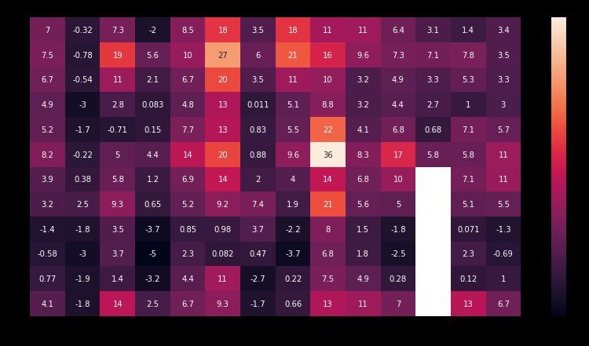

# Seaborn使用教学

## Line Chart

可以直接调用dataframe来绘制其中所有的数据折线图 必须是数字

```py
plt.figure(figsize=(20,10))
plt.title('Weirdo_lineplot')
sns.lineplot(data=Weirdo_dataframe)
```

  


也可以通过读取dataframe的某一列，来单独对这一列进行绘制

```py
sns.lineplot(data=weirdo_dataframe[column_1],label='column_1')
plt.xlabel('anything')
```

  


## barcharts

对dataframe中的某一列数据做跟随索引变化的柱状图 必须是数字

```py
sns.barplot(x=Weirdo_data.index, y=Weirdo_data['column_1'])
plt.ylabel('column_1')
```

  

## heapmap

对整张表格进行颜色深浅关联数据大小的图的绘制

annot是设置图中的方块里是否显示数据的值

```py
sns.heatmap(data=Weirdo_data,annot=True)
```

  

## scatterplot

### 普通scatterplot

做两列连续数据的相对关系的变化图

```py
sns.scatterplot(x=Weirdo_data['column_1'],y=Weirdo_data['column_2'])
```

  

### 带回归线的regeplot

可以在其中加入其对应的回归线

```py
sns.regplot(x=Weirdo_data['column_1'],y=Weirdo_data['column_2'])
```

  

### 对点做分类的scatterplot

可以增加一个参数hue，将某个只有有限值的比如0，1的列赋给它

```py
sns.scatterplot(x=Weirdo_data['column_1'],y=Weirdo_data['column_2'],hue=Weirdo_data('column_3'))
```

  

在该类图像中也可以加入回归线 lmplot

```py
sns.lmplot(x=Weirdo_data['column_1'],y=Weirdo_data['column_2'],hue=Weirdo_data('column_3'))
```

  

### 将某一列的分布根据某一列分为两份，观察其总体范围的swarmplot

```py
sns.swarmplot(x=Weirdo_data['column_1'],y=Weirdo_data['column_2'])
```

  

## distributions

### 直方图 distplot

可以观察某一列出现的值对应的频率变化，其中kde表示是否用曲线

```py
sns.displot(data=Weirdo_data['column_1'],kde=False)
```

  


### 曲线形式的直方图 kdeplot

其中参数表示是否对线的下方填色

```py
sns.kdeplot(data=Weirdo_data['column_1'],shade=True)
```

  


### 2d的kdeplot jointplot

```py
sns.jointplot(x=Weirdo_data['column_1'],y=Weirdo_data['column_2'],kind='kde')
```

  


### 不同列的直方图  

可以在直方图中设置不同的列并设置它们的label来显示它们的legend,这样不同的列的信息就可以出现在同一张直方图中了

```py
sns.distplot(data=Weirdo_data['column_1'],
label="Iris-setosa", kde=False)
sns.distplot(data=Weirdo_data['Petal Length (cm)'],label="Iris-versicolor", kde=False)
sns.distplot(data=Weirdo_data['Petal Length (cm)'], label="Iris-virginica", kde=False)

plt.legend()
```
kdeplot也是同理

  

